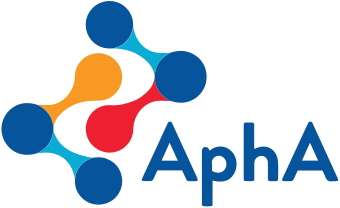

 
 

  

<h2 align="center">Find me</h2>

    

<h2 align="center">Coding using</h2>

 
 
 
 

 

## I'm currently working on:

 I've taken over responsibility for packages in my team that get data from the SQL server and get 'tidied' into R. This work currently cannot be shared publicly but [Milan Wiedemann](https://github.com/milanwiedemann), who built the concepts within the package, has written about it in the [blog](https://cdu-data-science-team.github.io/team-blog/posts/2021-08-06-nottshcverse/) on the team website.

 I have now recoded all the  Introduction to R and R Studio [Slides](https://philosopher-analyst.netlify.app/collection/) from pdf to xaringan. I'm now looking to build a [learnr package](https://github.com/nhs-r-community/NHSRtraining) for this course and working through the [RStudio/Alison Hill's RMarkdown slides](https://github.com/rstudio-education/communicate-rmd-workshop) along with the [NHS-R Community workshop material](https://github.com/nhs-r-community/intro_rmd) and [YouTube video](https://www.youtube.com/watch?v=RaM6fgwMZIs) to deliver a [RMarkdown course](https://github.com/Lextuga007/rmd-workshop).

## My other interests are...

I'm a Senior Fellow of the  and I run the [introduction to R and R Studio training](https://nhsrcommunity.com/events/) for NHS and other public sector analysts every 3rd Wednesday of the month.

I am the Non-Exec Director at  and run the bi-monthly [Ethics Group](https://www.aphanalysts.org/apha-events-and-training/). 

I chair Nottinghamshire Healthcare NHS Foundation Trust's Ethics Committe. To help share the resources I've accumulated relating to medical and data ethics I've created a [website](https://ethics-committee-resources.netlify.app/) using the [Hugo Apéro theme](https://github.com/hugo-apero/apero).

  
<b> Other ethics groups I go to (click on arrow or words to extend) </b>

  
✨ [Data Ethics Group](https://github.com/very-good-science/data-ethics-club)
 
✨ [Data Science Campus Ethics Society Reading Group](https://datasciencecampus.github.io/ethics_society_reading_group/)  
✨ Nottinghamshire Healthcare NHS Foundation Trust Ethics Committee - [resources](https://ethics-committee-resources.netlify.app/)   
✨ Nottingham University Hospitals Ethics Committee.

<!--
## Other repos to which I've contributed to:

Attributions: 
analysis by Flatart from the Noun Project
presentation by Garrett Knoll from the Noun Project
thinker by Gilbert Bages from the Noun Project
Venn Diagram by Josh Sorosky from the Noun Project

Badges from:

inspiration from https://github.com/claytonjhamilton/claytonjhamilton
https://github.com/Naereen/badges
https://github.com/ellerbrock/open-source-badges/blob/master/README.md - not used
https://github.com/anuraghazra/github-readme-stats
https://shields.io/category/build

-->
